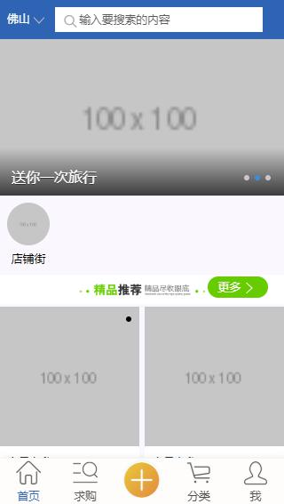
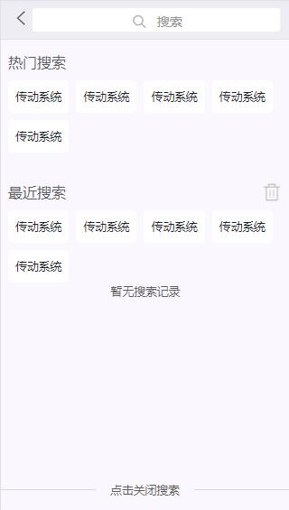
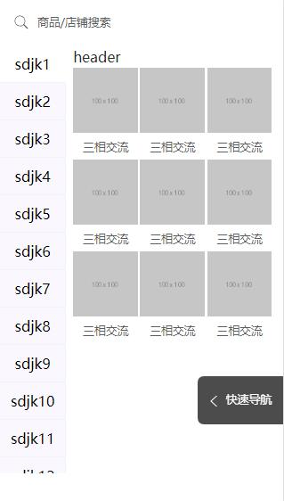
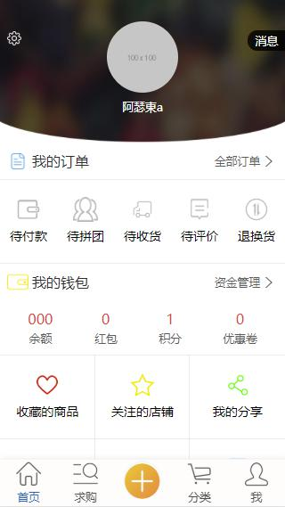

# project_vux_demo

> 这个一个基于vux的手机端商城，部分的页面还没有弄好 <__>

## 启动

``` bash
### 启动应用
npm run dev
###启动服务器(沒有弄了)
json-server --watch ./server/db.json

```
## 项目截图



## 注意事項
- 用hbuild打包應用時，出現圖片不能顯示出來，需要修改config>build>assetsPublicPath為: './'
- 出現點擊返回退出應用，參考[解决Hbuilder打包的app返回键直接退出](https://blog.csdn.net/qq_25252769/article/details/76913083)
